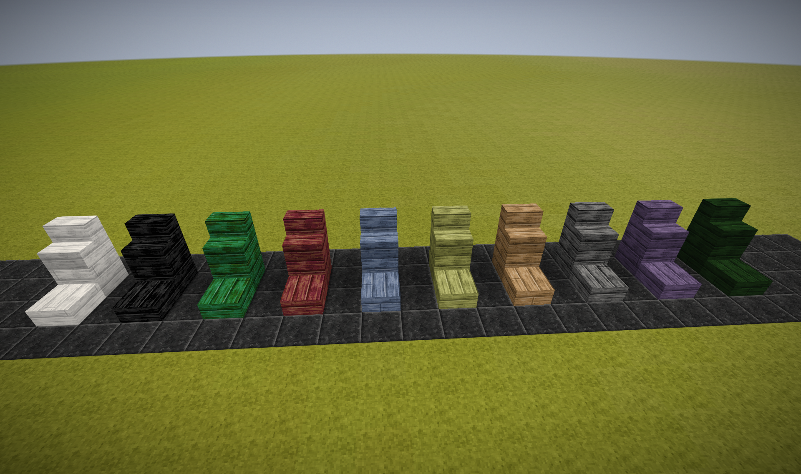
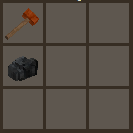
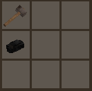
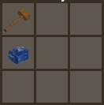
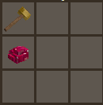
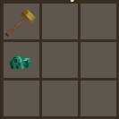
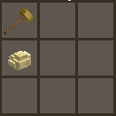
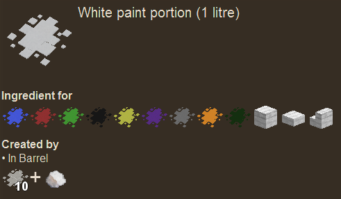
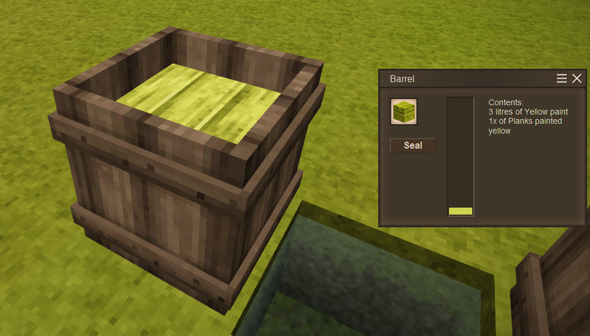

# Paints
A VintageStory Mod that adds paint preparation and coloured planks

## New blocks

Planks, plank slabs, plank stairs in six new colours: white, black, red, green, blue, yellow.

## Pigments

To create pigment use hammer to crush: 
 - coal/charcoal (black)
 
  
 
 - lapis lazuli (blue)
 
 
 
 - cinnabar (red)
 
 
 
 - malachite (green)
 
 
 
 - sulfur (yellow)
 
 

## Paint preparation

First you need to create white paint, which is base for all other paint colours. To create white paint mix 10 liters of limewater with 1 fat.

To create coloured paint mix 1 pigment with 10 litres of white paint.

## Painting planks

Simply put planks / plank slabs / plank stairs into a barrel with paint. One plank will consume 1 litre of paint.

