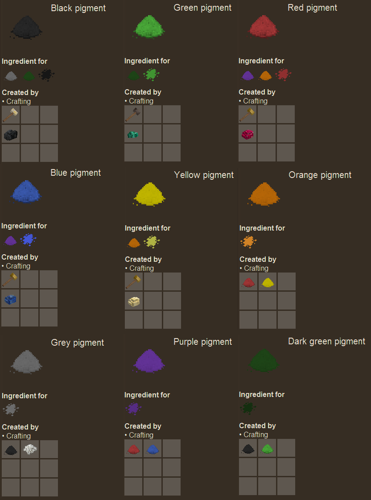

# Paints
A VintageStory Mod that adds paint preparation and coloured planks

## New blocks

Planks, plank slabs, plank stairs new colours: white, black, red, green, blue, yellow, orange, grey, purple, dark green.

## Pigments

## Paint preparation

First you need to create white paint, which is base for all other paint colours. To create white paint mix 10 liters of limewater with 1 fat.

To create coloured paint mix 1 pigment with 10 litres of white paint.

## Painting planks

Simply put planks / plank slabs / plank stairs into a barrel with paint. One plank will consume 1 litre of paint.

# Roadmap

 - Brush tool to paint existing blocks
 - Use shader effect to apply the paint on block instead of custom textures
 - More paintable blocks (fences, doors?)

# Bugs and feature requests reporting 

Please create an issue at
https://github.com/lonski/vintagestory-paints/issues
